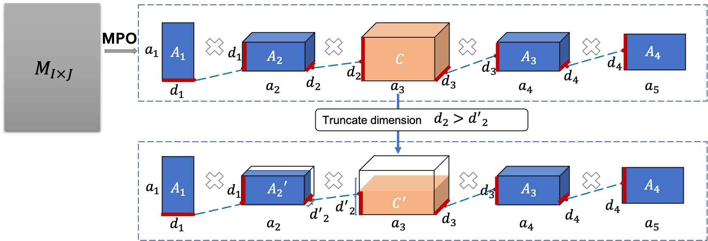

# Enabling Lightweight Fine-tuning for Pre-trained Language Model Compression based on Matrix Product Operators

This is our Pytorch implementation for the paper:
> Peiyu Liu, Ze-Feng Gao, Wayne Xin Zhao, Z.Y. Xie, Zhong-Yi Lu and Ji-Rong Wen(2021). Enabling Lightweight Fine-tuning for Pre-trained Language Model Compression based on Matrix Product Operators
# Introduction
This paper presents a novel pre-trained language models (PLM) compression approach based on the matrix product operator (short as MPO) from quantum many-body physics. It can decompose an original matrix into central tensors (containing the core information) and auxiliary tensors (with only a small proportion of parameters). With the decomposed MPO structure, we propose a novel fine-tuning strategy by only updating the parameters from the auxiliary tensors, and design an optimization algorithm for MPO-based approximation over stacked network architectures. Our approach can be applied to the original or the compressed PLMs in a general way, which derives a lighter network and significantly reduces the parameters to be fine-tuned. Extensive experiments have demonstrated the effectiveness of the proposed approach in model compression, especially the reduction in fine-tuning parameters (91% reduction on average).

 
 
For more details about the technique of MPOP, refer to our [paper](https://arxiv.org/abs/2106.02205)
 # Release Notes
 - First version: 2021/05/21
 - add albert code: 2021/06/08

# Requirements
- python 3.7
- torch >= 1.8.0


 # Installation
 ```shell
pip install mpo_lab
 ```
## Lightweight fine-tuning
In lightweight fine-tuning, we use original ALBERT without fine-tuning as to be compressed. By performing MPO decomposition on each weight matrix, we obtain four auxiliary tensors and one central tensor per tensor set. This provides a good initialization for the task-specific distillation. Refer to [run_all_albert_fine_tune.sh](https://github.com/lpyhdzx/MPOP/blob/ac958a78e1cf41d7f4117582a1aa2df3edf7e6fa/albert/run_all_albert_fine_tune.sh)

Important arguments:
```
--data_dir          Path to load dataset
--mpo_lr            Learning rate of tensors produced by MPO
--mpo_layers        Name of components to be decomposed with MPO
--emb_trunc         Truncation number of the central tensor in word embedding layer
--linear_trunc      Truncation number of the central tensor in linear layer
--attention_trunc   Truncation number of the central tensor in attention layer
--load_layer        Name of components to be loaded from exist checkpoint file
--update_mpo_layer  Name of components to be update when training the model
```
## Dimension squeezing
In Dimension squeezing, we compute approiate truncation order for the whole model. In order to re-produce the results in paper, we prepare the model after lightweight fine-tuning. Refer to [run_all_albert_fine_tune.sh](https://github.com/lpyhdzx/MPOP/blob/ac958a78e1cf41d7f4117582a1aa2df3edf7e6fa/albert/run_all_albert_fine_tune.sh)

albert models [google drive](https://drive.google.com/file/d/1shpcqfDemRaWhxIwcczDB_YePIyyF0bk/view?usp=sharing)

## Acknowledgment
Any scientific publications that use our codes should cite the following paper as the reference:
```
@inproceedings{Liu-ACL-2021,
  author    = {Peiyu Liu and
               Ze{-}Feng Gao and
               Wayne Xin Zhao and
               Z. Y. Xie and
               Zhong{-}Yi Lu and
               Ji{-}Rong Wen},
  title     = "Enabling Lightweight Fine-tuning for Pre-trained Language Model Compression
               based on Matrix Product Operators",
  booktitle = {{ACL}},
  year      = {2021},
}
```
## TODO

- [x] prepare data and code
- [x] upload models in order to reproduce experiments
- [ ] supplementary details for paper
